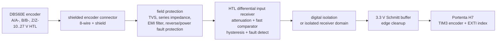

# ENCODER_DBS60E_INPUT_KO

## 대상 엔코더
파일: `dataSheet_DBS60E-THEJD2048_1116617_ko.pdf`

- 모델: SICK `DBS60E-THEJD2048`, 부품 번호 `1116617`
- 타입: incremental encoder
- 회전당 펄스: 2048 PPR
- 인터페이스: HTL / push-pull
- 채널: 6채널, `A`, `A-`, `B`, `B-`, `Z`, `Z-`
- 공급 전압: 10..27 V
- 출력 빈도: 300 kHz
- 채널당 부하 전류: 최대 30 mA
- 연결: 8선 케이블, 0.5 m
- 동작 rpm: 6000 min^-1, 기계적 최대 rpm: 9000 min^-1

## 전기적 판단
이 엔코더는 Portenta H7 GPIO에 직접 연결하면 안 된다. Portenta H7의 회로 동작 전압은 3.3 V이고, 데이터시트상 엔코더 출력은 10..27 V HTL push-pull이다.

따라서 최종 하드웨어는 아래 입력 체인을 사용한다.

## 입력 회로 원칙
- `A/A-`, `B/B-`, `Z/Z-`는 차동 쌍으로 취급한다.
- A, B, Z 중 한쪽 선만 single-ended로 받아 양산형 입력이라고 주장하지 않는다.
- 표준 RS-422 receiver를 24 V HTL에 직접 연결하지 않는다. 일반 RS-422 receiver의 common-mode/input 허용 범위는 24 V HTL pair를 직접 받기에는 부족하다.
- 권장 구현은 field side에서 24 V tolerant attenuation/protection 후 high-speed comparator로 차동 판정하고, MCU side는 절연된 3.3 V logic만 받는 구조다.
- comparator/isolator/buffer 전체 지연은 채널 간 skew를 작게 유지해야 한다. 속도 여유는 최소 1 MHz edge 이상으로 잡는다.
- Z index도 A/B와 같은 front-end 등급으로 처리한다. 단순 저속 GPIO 입력 회로로 낮추지 않는다.

## 전원/보호
- 엔코더 전원은 field 24 V rail에서 공급하고, 보드 logic 3.3 V와 직접 섞지 않는다.
- 엔코더 +Us에는 resettable fuse 또는 eFuse, reverse polarity protection, surge/ESD TVS를 둔다.
- 엔코더 GND는 field return으로 받고, logic GND와 직접 결합하지 않는다. 비절연 설계를 선택하는 경우에도 chassis/shield/logic return 정책을 문서화해야 한다.
- shield는 chassis/earth 기준으로 360도 접속을 우선하고, 보드 logic GND로 긴 pigtail 접속하지 않는다.
- 커넥터 근처에 ESD/fast transient protection을 배치한다.

## 와이어 할당
데이터시트의 8선 케이블 색상 기준이다.

| 엔코더 선색 | 신호 | 보드 입력 처리 |
| --- | --- | --- |
| 흰색 | `A` | A differential receiver + |
| 갈색 | `A-` | A differential receiver - |
| 담홍색 | `B` | B differential receiver + |
| 검은색 | `B-` | B differential receiver - |
| 자주색 | `Z` | Z differential receiver + |
| 노란색 | `Z-` | Z differential receiver - |
| 빨간색 | `+Us` | protected 10..27 V encoder supply |
| 파란색 | `GND` | protected field return |
| 차폐 | shield | chassis/earth shield termination |

## Portenta 입력 핀 최종 지정
`PC6`/`PC7`은 STM32H747의 `TIM3_CH1`/`TIM3_CH2`로 묶어서 quadrature encoder mode에 사용한다. `TIM5`는 M7 Arduino/Mbed us_ticker에서 사용되므로 PH10/PH11 기반 encoder 설계는 제외한다.

| 보드 내부 신호 | Portenta 핀 | STM32 포트 | High-density | MCU 기능 | 용도 |
| --- | --- | --- | --- | --- | --- |
| `ENC_DRV_A_3V3` | `D5` | `PC6` | `J2-61` | `TIM3_CH1` | quadrature A |
| `ENC_DRV_B_3V3` | `D4` | `PC7` | `J2-63` | `TIM3_CH2` | quadrature B |
| `ENC_DRV_Z_3V3` | `D6` | `PA8` | `J2-59` | `EXTI8`, optional timer input | index pulse timestamp |
| `ENC_DRV_FAULT_N` | `D13` | `PA10` | MKR/HD exposed | GPIO interrupt | receiver/cable/power fault |

## 펌웨어 캡처 정책
- A/B는 interrupt counting이 아니라 TIM3 encoder mode로 하드웨어 카운트한다.
- TIM3는 16-bit timer이므로 overflow/underflow extension을 구현해 signed 64-bit position으로 승격한다.
- Z index 상승 edge에서 아래를 같은 record로 남긴다.
  - `mono64`
  - TIM3 extended count snapshot
  - A/B logic state
  - Z edge polarity
  - receiver fault flags
- `ENC_EDGE_RAW`는 원신호 edge/index/overflow 이벤트를 보존한다.
- `ENC_DERIVED`는 position, rpm, direction, missed-edge suspicion 같은 계산값만 담는다.
- raw와 derived를 같은 record로 덮어쓰지 않는다.

## 속도 검토
2048 PPR에서 6000 rpm이면 A 또는 B의 pulse frequency는 약 204.8 kHz다. x4 quadrature edge 기준으로는 약 819.2 kedge/s다.

300 kHz 출력 빈도 한계를 그대로 적용하면 2048 PPR에서 전기적 상한은 약 8789 rpm이다. 데이터시트의 9000 rpm은 기계적 최대 조건으로 보고, 최종 시스템 운용 한계는 정상 운전 6000 rpm, 전기 fault threshold 300 kHz 근접으로 둔다.

## 하드웨어 수락 기준
- 24 V HTL 입력을 Portenta 3.3 V GPIO에 직접 연결한 경로가 없어야 한다.
- A/B/Z 세 pair 모두 protection, receiver, isolation/buffer 경로가 문서화되어야 한다.
- 300 kHz channel signal과 819.2 kedge/s quadrature event rate에서 누락 없이 카운트되어야 한다.
- receiver fault, field power loss, cable open/short 가능 상태가 `BOARD_EVENT` 또는 `BOARD_HEALTH`로 올라와야 한다.
- CAN flood와 encoder maximum-rate injection을 동시에 걸어도 CAN RX raw와 encoder raw가 서로 조용히 밀어내면 안 된다.
