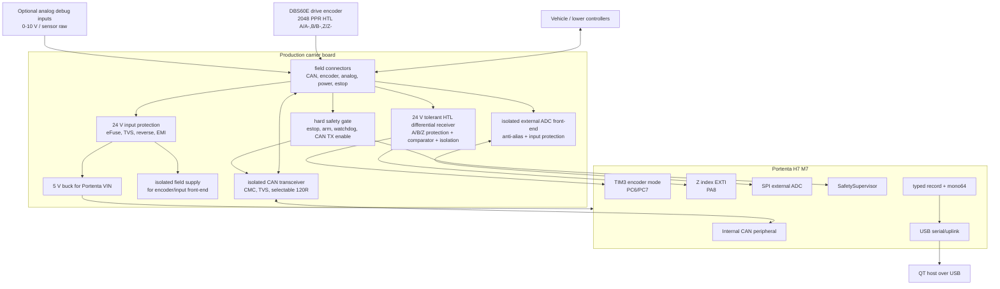

# HARDWARE_FINAL_CONCEPT_KO

## 2026-05-14 Mid Carrier + TJA1051 migration note
- Next production target is Portenta H7 M7 + Portenta Mid Carrier ASX00055.
- Production `bus=0` is Mid Carrier J14 `CAN0_TX/RX` wired to an Adafruit
  ADA-5708 TJA1051T/3 transceiver.
- Production `bus=1` is Mid Carrier J4 terminal CAN1 through the carrier onboard
  U2 CAN physical path.
- MCP2515/TJA1050 remains a verified bench/legacy CAN controller path only.
- TJA1051T/3 is a physical transceiver, not a CAN controller; firmware must open
  the Portenta internal CAN peripheral in Classic CAN 2.0 mode.
- See `board/docs/HARDWARE_MID_TJA1051_DUAL_CAN_KO.md` for the migration pin and
  validation checklist.

## 2026-04-22 MCP2515 INT 최종 적용
- MCP2515 `INT_N`은 하드웨어적으로 사용 가능하며, Portenta `D11/PH8`에 level-shifted active-low 신호로 연결한다.
- firmware는 `INT_N`을 edge-only gate로 쓰지 않는다. `INT_N`은 active-low level hint이고, 실제 RX 처리는 MCP2515 `CANINTF`/`EFLG` 상태와 bounded RX FIFO drain state machine이 담당한다.
- `portenta_h7_m7_mcp_int_main`은 PCAN 500 kbps, ID `0x202`, DLC 8, 10 ms 송신에서 `can_ok=1`, `can_drop=0`, `fault=0x00000000`, health `flags=0x0A`로 HIL 확인됐다.
- `portenta_h7_m7_mcp_polling_recovery`는 복구/비교 기준으로 유지한다. `portenta_h7_m7_mcp_exti_hint_main`은 EXTI hint 실험용이며 기본 생산 후보는 아니다.

## 최종 결론
최종 보드는 Arduino Portenta H7 M7을 단순 CAN-USB 브리지로 쓰지 않는다. Portenta H7은 고속 처리/USB uplink/typed record 생성 코어로 쓰고, 실제 차량/산업 현장과 맞닿는 회로는 carrier board에서 산업용 보호, 절연, 전원 감시, 입력 수신을 담당한다.

현재 `src/main.cpp`의 20B CAN stream은 bring-up 및 호환 모드다. 양산 기본 구조는 `shared/docs/TRANSPORT_AND_RECORDS_KO.md`의 typed record 계약을 따르는 evidence board다.

## 전체 구상도

## 전원 구조
- 입력 전원은 차량/장비 24 V nominal을 기준으로 한다.
- 허용 입력 범위는 9..36 V 설계를 목표로 잡고, 실제 부품 선정 시 load dump/surge 등급을 다시 검토한다.
- 전원 입력단은 아래 순서를 기본으로 한다.
  1. fuse 또는 eFuse
  2. reverse polarity protection
  3. surge/ESD TVS
  4. common-mode / differential EMI filter
  5. 5 V buck regulator
  6. Portenta VIN 또는 5 V rail
- field input front-end는 logic ground와 직접 섞지 않는다. 엔코더/아날로그/CAN field side는 절연 또는 명시적인 single-point reference 정책을 둔다.
- power-good, field-power-good, brownout event는 `BOARD_HEALTH`로 올라와야 한다.

## 접지와 차폐
- 최소 접지 도메인:
  - `CHASSIS_SHIELD`: 커넥터 실드, 케이블 차폐, 섀시 접속
  - `FIELD_0V`: 차량/센서 전원 return
  - `LOGIC_GND`: Portenta, USB, typed record logic
- 엔코더 shield와 CAN shield는 커넥터 입구에서 chassis에 짧고 넓게 접속한다.
- shield를 logic ground에 긴 pigtail로 연결하지 않는다.
- 절연 경계를 넘는 신호는 digital isolator 또는 isolated transceiver만 통과한다.

## CAN 물리층
- 양산 carrier 기본안은 Portenta 내장 CAN + isolated CAN transceiver다.
- MCU built-in CAN pins:
  - `CAN0_TX`: `PH13`, Portenta high-density `J1-49`, labeled `CAN1_TX`
  - `CAN0_RX`: `PB8`, Portenta high-density `J1-51`, labeled `CAN1_RX`
- carrier board에는 isolated CAN transceiver를 둔다.
- CAN connector에는 `CAN_H`, `CAN_L`, `CAN_GND/FIELD_0V`, `SHIELD`를 둔다.
- CAN front-end에는 common-mode choke, CAN ESD/TVS, selectable 120 ohm termination을 둔다.
- termination은 DIP switch 또는 solder jumper로 선택한다. 기본값은 off로 둔다.
- control 기능이 들어가면 transceiver silent/standby 또는 TXD gate는 `SafetySupervisor`와 hard safety gate가 함께 제어한다.
- estop/FAULT 상태에서도 CAN RX evidence는 가능하면 유지하고, control CAN TX만 차단하는 방향을 우선한다.

## CAN 벤치 bring-up: MCP2515 + TJA1050 모듈
현재 벤치 테스트는 첨부된 `MCP2515 CAN BUS TJA1050.png` 형태의 MCP2515 SPI CAN controller + TJA1050 transceiver 모듈을 지원한다.

단일 CAN 벤치 시험에서는 Portenta `PH13/PB8` 내장 CAN 핀을 연결하지 않고 MCP2515만 사용했다. 2채널 벤치 시험에서는 Portenta 내장 CAN + 별도 CAN transceiver를 한 채널로 쓰고, MCP2515+TJA1050 모듈을 다른 채널로 쓴다. 두 CAN 물리 bus는 서로 섞지 않는다.

| MCP2515 module pin | Portenta pin | STM32 port | 설명 |
| --- | --- | --- | --- |
| `SCK` | `D9` | `PI1` | SPI clock |
| `SI` | `D8` | `PC3` | SPI MOSI, Portenta -> MCP2515 |
| `SO` | `D10` | `PC2` | SPI MISO, MCP2515 -> Portenta |
| `CS` | `D7` | `PI0` | SPI chip select |
| `INT` | `D11` | `PH8` | active-low interrupt |
| `GND` | `LOGIC_GND` | - | logic ground |
| `VCC` | see caution | - | module supply |
| screw `H` | PCAN `CAN_H` | - | CAN high |
| screw `L` | PCAN `CAN_L` | - | CAN low |

주의:
- 대부분의 MCP2515+TJA1050 모듈은 5 V 모듈이다. Portenta H7 GPIO는 3.3 V 기준이므로 `SO`, `INT` 등 모듈 출력이 5 V이면 Portenta에 직접 연결하면 안 된다.
- 5 V 모듈이면 `SCK`, `SI`, `CS`, `SO`, `INT` 전부에 3.3 V <-> 5 V level shifting을 넣는다. 최소한 MCP2515가 Portenta로 내보내는 `SO`, `INT`는 반드시 3.3 V로 제한해야 한다.
- 현재 최종 벤치 구성은 MCP2515 `CS/SCK/SI/SO/INT` 5선을 모두 level shifting하고, firmware는 MCP2515 `INT`를 active-low interrupt로 사용한다.
- 모듈 crystal은 사진상 8 MHz 계열로 보고 firmware는 `MCP_8MHZ`, `CAN_500KBPS`로 설정한다. 수신이 안 되면 가장 먼저 crystal 주파수 8/16 MHz를 확인한다.
- PCAN과 1:1 연결이면 CAN bus 양 끝에 120 ohm 종단이 필요하다. 모듈의 `J1/J3` jumper가 종단 저항일 수 있으므로 실제 보드 패턴을 확인한다.

## 구동 엔코더 입력
구동 엔코더는 `board/docs/ENCODER_DBS60E_INPUT_KO.md`를 기준으로 한다.

- 대상: SICK `DBS60E-THEJD2048`, 2048 PPR, 10..27 V HTL push-pull, A/A-, B/B-, Z/Z-
- A/B/Z는 모두 24 V tolerant differential receiver chain을 거쳐 3.3 V logic으로 변환한다.
- Portenta GPIO 직접 입력은 금지한다.
- 최종 MCU 핀:
  - A: `D5` / `PC6` / `J2-61` / `TIM3_CH1`
  - B: `D4` / `PC7` / `J2-63` / `TIM3_CH2`
  - Z: `D6` / `PA8` / `J2-59` / `EXTI8`
- `PH10`/`PH11` 기반 TIM5 encoder 설계는 제외한다. Portenta H7 M7 런타임에서 TIM5가 us_ticker로 사용되므로 시간축과 충돌할 수 있다.

## 외부 아날로그 입력
아날로그 debug는 양산 핵심 제어 입력이 아니라 evidence/debug lane이다. 그래도 차량 field 신호를 직접 Portenta ADC에 넣지 않는다.

- 기본안은 isolated external ADC front-end다.
- analog input connector는 각 채널마다 `AIN+`, `AIN- 또는 FIELD_0V`, `SHIELD` 정책을 갖는다.
- 입력 범위는 0..10 V debug를 기본으로 하고, 0..5 V 또는 4..20 mA는 부품/저항 옵션으로 분기한다.
- 각 채널에는 input resistor, RC anti-alias filter, clamp/protection, open/overrange 감시를 둔다.
- external ADC는 SPI로 Portenta와 연결한다. SPI 경계에는 digital isolation을 둔다.
- Portenta 내부 ADC A0..A3는 lab-only fallback으로만 둔다. 양산 evidence에는 field isolation이 있는 external ADC를 기본으로 한다.

## 외부 ADC SPI 핀
| 보드 내부 신호 | Portenta 핀 | STM32 포트 | 용도 |
| --- | --- | --- | --- |
| `ADC_SPI_COPI` | `D8` | `PC3` | isolated ADC SPI data out |
| `ADC_SPI_SCK` | `D9` | `PI1` | isolated ADC SPI clock |
| `ADC_SPI_CIPO` | `D10` | `PC2` | isolated ADC SPI data in |
| `ADC_SPI_CS_N` | `D7` | `PI0` | isolated ADC chip select |
| `ADC_DRDY_N` | `D11` | `PH8` | ADC data-ready interrupt |

## 안전/제어 하드웨어
안전은 firmware state machine만으로 완성됐다고 보지 않는다. 아래 hard safety path가 있어야 한다.

- estop input은 MCU로만 들어가지 않고, control TX gate에도 직접 반영된다.
- power-on 기본값은 `MONITOR_ONLY`, CAN control TX disabled다.
- watchdog이 멈추면 CAN control TX gate는 disabled가 된다.
- reconnect 후 자동 armed는 금지한다.
- arm switch 또는 host arm request는 lease/heartbeat/health 조건과 함께 확인한다.

## 안전/제어 핀
| 보드 내부 신호 | Portenta 핀 | STM32 포트 | 기본 상태 | 용도 |
| --- | --- | --- | --- | --- |
| `ESTOP_IN_N` | `D2` | `PJ11` | pulled low/fault | isolated estop chain input |
| `ARM_KEY_IN` | `D3` | `PG7` | inactive | local/service arm permission |
| `CAN_TX_ENABLE` | `D1` | `PK1` | disabled | hard gate for control CAN TX |
| `SAFETY_WD_TOGGLE` | `D0` | `PH15` | inactive | external safety watchdog heartbeat |
| `FIELD_PWR_OK` | `D12` | `PH7` | false | field power monitor input |
| `ENC_DRV_FAULT_N` | `D13` | `PA10` | pulled low/fault | encoder receiver/cable/power fault |
| `SPARE_SERVICE_GPIO` | `D14` | `PA9` | inactive | service/debug spare, disabled in production default |

## 최종 핀맵 요약
| Lane | Signal | Portenta | STM32 | 비고 |
| --- | --- | --- | --- | --- |
| CAN | `CAN0_TX` | HD `J1-49` | `PH13` | isolated CAN TX |
| CAN | `CAN0_RX` | HD `J1-51` | `PB8` | isolated CAN RX |
| Encoder | `ENC_DRV_A_3V3` | `D5` | `PC6` | TIM3_CH1 |
| Encoder | `ENC_DRV_B_3V3` | `D4` | `PC7` | TIM3_CH2 |
| Encoder | `ENC_DRV_Z_3V3` | `D6` | `PA8` | EXTI8 index |
| MCP2515 CAN | `CAN_SPI_COPI` | `D8` | `PC3` | SPI MOSI / SI |
| MCP2515 CAN | `CAN_SPI_SCK` | `D9` | `PI1` | SPI SCK |
| MCP2515 CAN | `CAN_SPI_CIPO` | `D10` | `PC2` | SPI MISO / SO |
| MCP2515 CAN | `CAN_SPI_CS_N` | `D7` | `PI0` | MCP2515 CS |
| MCP2515 CAN | `CAN_INT_N` | `D11` | `PH8` | MCP2515 INT |
| Safety | `ESTOP_IN_N` | `D2` | `PJ11` | isolated input |
| Safety | `ARM_KEY_IN` | `D3` | `PG7` | isolated/service input |
| Safety | `CAN_TX_ENABLE` | `D1` | `PK1` | default disabled |
| Safety | `SAFETY_WD_TOGGLE` | `D0` | `PH15` | external watchdog |
| Safety | `FIELD_PWR_OK` | `D12` | `PH7` | health input |
| Encoder | `ENC_DRV_FAULT_N` | `D13` | `PA10` | front-end fault |
| Service | `SPARE_SERVICE_GPIO` | `D14` | `PA9` | reserved |

## Record 대응
- CAN RX physical frame -> `CAN_RX_RAW`
- actual CAN TX physical frame -> `CAN_TX_RAW`
- encoder A/B/Z edge, index, overflow, receiver fault -> `ENC_EDGE_RAW`
- position/rpm/direction/missed-edge suspicion -> `ENC_DERIVED`
- external ADC sample/overrange/open/fault -> `ADC_SAMPLE`
- host command accept/reject -> `CONTROL_ACK`
- estop, watchdog, lease timeout, power fault, bus fault -> `BOARD_EVENT`
- drop counters, queue depth, power state, field fault, transport state -> `BOARD_HEALTH`

## PCB/배치 기준
- CAN, encoder, analog connector는 보드 edge에 배치하고 보호소자를 커넥터 바로 뒤에 둔다.
- isolation barrier는 silkscreen과 copper keepout으로 명확히 나눈다.
- high-speed encoder A/B/Z 3.3 V logic은 TIM3 pins까지 짧고 길이 차이를 작게 둔다.
- CAN differential pair는 transceiver까지 short, symmetric, controlled return path를 둔다.
- switching regulator는 encoder receiver/comparator와 멀리 두고, analog front-end에는 별도 quiet rail/filter를 둔다.
- Portenta high-density connector 주변에는 probe pad를 둔다.

## 양산 전 필수 검증
- 24 V input reverse/surge/ESD 보호 검증
- CAN bus dominant/recessive, bus-off, termination on/off 검증
- encoder 204.8 kHz/channel 정상 조건 검증
- encoder 300 kHz/channel 근접 fault/event 검증
- Z index timestamp와 TIM3 count snapshot 일관성 검증
- analog overrange/open/fault visibility 검증
- estop, watchdog stop, lease timeout, reconnect no-auto-arm 검증
- CAN flood + encoder max-rate + ADC burst 동시 부하에서 hidden drop 없음 또는 visible drop/event 검증
